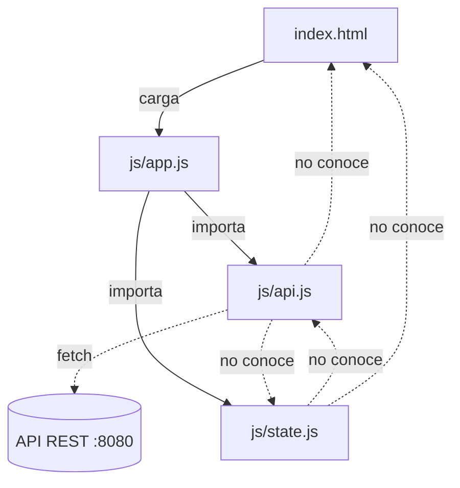
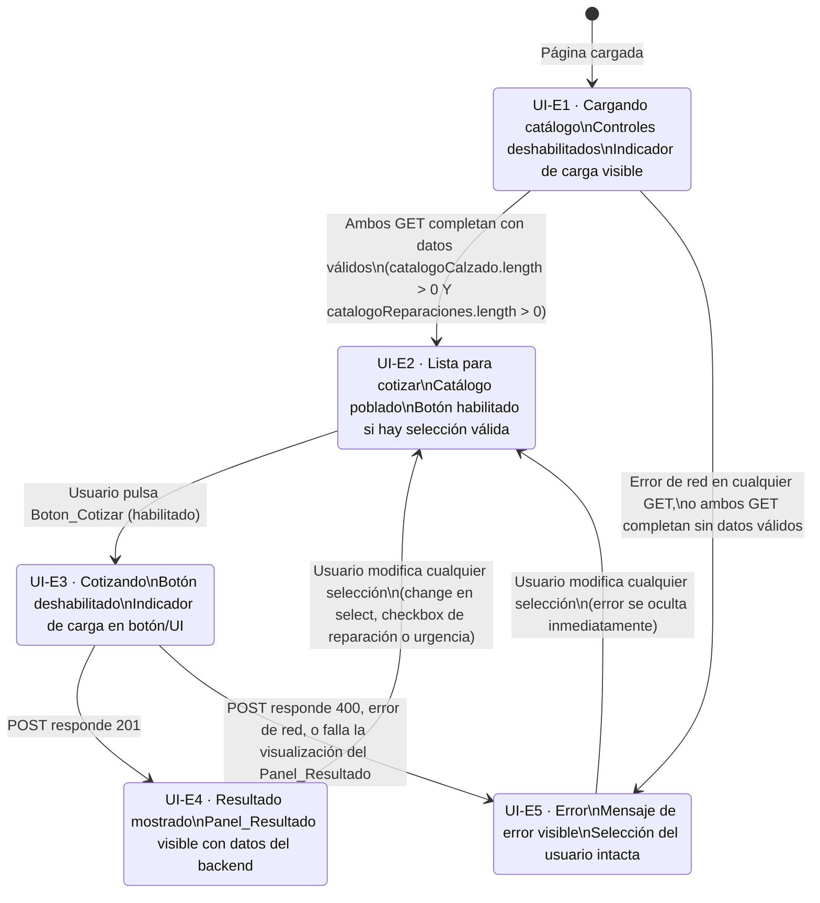

# Design Document — Cotizador UI

## Overview

El **Cotizador de Calzado** es una aplicación web de página única que permite obtener cotizaciones de reparación de calzado consultando una API REST. El usuario selecciona el tipo de calzado, elige los servicios de reparación, indica si el servicio es urgente y recibe un desglose calculado por el backend.

### Principios de diseño

- **El frontend no calcula nada.** Subtotal, recargo de urgencia, total y tiempo estimado siempre provienen de la respuesta del backend (`POST /api/cotizaciones`). El frontend solo presenta lo que recibe, sin ninguna transformación aritmética adicional.
- **Arquitectura modular con ES Modules.** Separación estricta entre capa de acceso a la API (`api.js`), gestión de estado (`state.js`) y coordinación de la UI (`app.js`).
- **Regla de dependencia única.** `state.js` y `api.js` son independientes entre sí y no conocen el DOM. Toda coordinación pasa por `app.js`.
- **Estado en memoria.** Sin `localStorage` ni `sessionStorage`: al recargar la página, el estado comienza limpio (Req 10.1).
- **Accesibilidad WCAG 2.1 AA** mediante etiquetas semánticas, `aria-live`, atributo `disabled` nativo y textos descriptivos en todos los controles.

---

## Architecture

### Estructura de archivos

```
cotizador-frontend/
├── index.html          ← Estructura y layout. Expone IDs estables. Sin lógica.
├── css/
│   └── estilos.css     ← Estilos visuales. Sin lógica.
└── js/
    ├── api.js          ← Único módulo que conoce las URLs. Fetch + traducción HTTP→JS.
    ├── state.js        ← Estado en memoria. Sin DOM ni fetch.
    └── app.js          ← Coordina state.js y api.js. Escucha y actualiza el DOM.
```

### Diagrama de dependencias



### Diagrama de estados de la pantalla



### Reglas de habilitación del botón (UI-01)

El botón `#btn-cotizar` está habilitado si y solo si se cumplen **simultáneamente**:

1. `tipoCalzadoId` es un string no vacío (`!== ''`), **Y**
2. `reparacionesIds` contiene al menos un elemento (`size >= 1`)

La evaluación es **puramente estática**: solo examina el estado actual del formulario, sin historial de selecciones previas. El botón se deshabilita también durante UI-E1, UI-E3 y siempre que alguna condición de bloqueo esté activa.

---

## Components and Interfaces

### `js/api.js`

Único módulo que conoce `http://localhost:8080/api`. Traduce respuestas HTTP a objetos JS y propaga errores estructurados. No conoce el DOM ni el estado.

```js
const API_BASE_URL = 'http://localhost:8080/api';

/**
 * Obtiene el catálogo de tipos de calzado.
 * @returns {Promise<TipoCalzado[]>}
 * @throws {ApiError} si la respuesta no es 2xx o hay error de red
 */
export async function obtenerTiposCalzado() { /* ... */ }

/**
 * Obtiene el catálogo de tipos de reparación.
 * @returns {Promise<TipoReparacion[]>}
 * @throws {ApiError} si la respuesta no es 2xx o hay error de red
 */
export async function obtenerTiposReparacion() { /* ... */ }

/**
 * Envía la solicitud de cotización al backend.
 * Serializa esUrgente → urgente en el body del POST (contrato OpenAPI).
 * @param {CotizacionRequest} request
 * @returns {Promise<CotizacionResponse>}
 * @throws {ApiError} statusCode=400, detail=ProblemDetails.detail si el backend responde 400
 * @throws {ApiError} statusCode=0 si hay error de red sin respuesta del servidor
 * @throws {ApiError} statusCode=5xx si el backend responde con error de servidor
 */
export async function generarCotizacion(request) { /* ... */ }

/**
 * Error estructurado para errores de la API. Todos los errores de api.js
 * se propagan como instancias de ApiError para que app.js no interprete HTTP.
 * @typedef {Object} ApiError
 * @property {number} statusCode  - 0 para error de red, 400/5xx para errores del backend
 * @property {string} detail      - Mensaje legible; campo `detail` del ProblemDetails para 400
 * @property {string} [type]      - URI RFC 7807 (solo presente en errores 400)
 */
```

**Nota de serialización:** `api.js` traduce el campo `esUrgente` del estado JS al campo `urgente` requerido por el contrato OpenAPI al construir el body del POST.

### `js/state.js`

Gestiona el estado en memoria. No accede al DOM ni hace `fetch`. Implementa el patrón Observer ligero para notificar a `app.js`.

```js
/**
 * Estado interno de la aplicación.
 * @typedef {Object} AppState
 * @property {TipoCalzado[]}            catalogoCalzado      - Catálogo cargado desde la API
 * @property {TipoReparacion[]}         catalogoReparaciones - Catálogo cargado desde la API
 * @property {string}                   tipoCalzadoId        - ID seleccionado; "" si ninguno
 * @property {Set<string>}              reparacionesIds      - IDs de reparaciones activas
 * @property {boolean}                  esUrgente            - Estado del checkbox de urgencia
 * @property {CotizacionResponse|null}  ultimaCotizacion     - Última respuesta 201 del backend
 * @property {'idle'|'loading-catalogo'|'cotizando'|'resultado'|'error'} fase
 */

/** Devuelve una copia superficial del estado actual. */
export function getEstado() { /* ... */ }

/**
 * Actualiza campos del estado y notifica a todos los observadores registrados.
 * @param {Partial<AppState>} cambios
 */
export function setEstado(cambios) { /* ... */ }

/**
 * Registra un callback invocado cada vez que el estado cambia (Observer ligero).
 * @param {(estado: AppState) => void} callback
 */
export function onCambio(callback) { /* ... */ }
```

### `js/app.js`

Módulo de arranque. Escucha eventos del DOM, coordina `state.js` y `api.js`, y decide qué renderizar en cada transición de estado. Es el único módulo que conoce tanto el DOM como los otros módulos.

```js
// ── Arranque ──────────────────────────────────────────────────────────────

/** Punto de entrada. Registra listeners DOM y carga el catálogo. */
async function init() { /* ... */ }

// ── Coordinación ──────────────────────────────────────────────────────────

/**
 * Carga el catálogo llamando a ambos endpoints en paralelo (Promise.all).
 * Puebla los controles DURANTE la transición a UI-E2, antes de completarla.
 * Si algún endpoint falla o devuelve array vacío → transiciona a UI-E5.
 */
async function cargarCatalogo() { /* ... */ }

/**
 * Construye el objeto request a partir del estado actual (Factory simple).
 * Función pura: no tiene efectos secundarios.
 * @param {AppState} estado
 * @returns {CotizacionRequest}
 */
export function construirRequestCotizacion(estado) {
  return {
    tipoCalzadoId:     estado.tipoCalzadoId,
    tipoReparacionIds: Array.from(estado.reparacionesIds),
    esUrgente:         estado.esUrgente,
  };
}

/**
 * Handler del click en "Cotizar".
 * Transiciona a UI-E3, llama a generarCotizacion(), luego a UI-E4 o UI-E5.
 * Si la visualización del Panel_Resultado falla → transiciona a UI-E5.
 */
async function handleCotizar() { /* ... */ }

// ── Renderizado ───────────────────────────────────────────────────────────

/** Rellena el select de tipos de calzado a partir del catálogo en estado. */
function renderizarCalzado(estado) { /* ... */ }

/** Rellena los checkboxes de reparación a partir del catálogo en estado. */
function renderizarReparaciones(estado) { /* ... */ }

/**
 * Evalúa la regla UI-01 y aplica/elimina el atributo disabled en #btn-cotizar.
 * Evaluación estática pura: solo depende del estado actual del formulario.
 */
function sincronizarBoton(estado) { /* ... */ }

/**
 * Rellena el Panel_Resultado con los valores del backend.
 * Siempre muta el contenido del DOM para forzar el anuncio aria-live,
 * incluso si el contenido es idéntico al mostrado anteriormente.
 * @param {CotizacionResponse} cotizacion
 */
function renderizarResultado(cotizacion) { /* ... */ }

/** Muestra un mensaje de error en #mensaje-error (sin modal). */
function mostrarError(mensaje) { /* ... */ }

/** Oculta el mensaje de error en #mensaje-error. */
function limpiarError() { /* ... */ }

/**
 * Oculta el Panel_Resultado inmediatamente.
 * Invocado en el evento change de cualquier control mientras la fase es 'resultado' o 'error'.
 */
function ocultarResultado() { /* ... */ }
```

**Comportamiento del observer:** `app.js` registra un único callback con `onCambio()` que llama a las funciones de renderizado correspondientes según el valor de `estado.fase`.

### `index.html` — Esqueleto semántico

```html
<!-- Indicador de carga del catálogo (visible durante UI-E1) -->
<div id="indicador-carga-catalogo" aria-live="polite" hidden>Cargando catálogo…</div>

<form id="cotizador-form" novalidate>

  <!-- Selector de tipo de calzado -->
  <fieldset id="fs-calzado">
    <legend>Tipo de calzado</legend>
    <label for="tipo-calzado-select">
      Tipo de calzado <span aria-hidden="true">*</span>
    </label>
    <select id="tipo-calzado-select" disabled required>
      <option value="" disabled selected>Selecciona un tipo</option>
      <!-- opciones inyectadas dinámicamente por renderizarCalzado() -->
    </select>
  </fieldset>

  <!-- Lista de tipos de reparación -->
  <fieldset id="fs-reparaciones">
    <legend>Tipos de reparación</legend>
    <!-- checkboxes inyectados dinámicamente por renderizarReparaciones() -->
    <!-- Patrón: <label for="rep-{id}">
                   <input type="checkbox" id="rep-{id}" value="{id}" disabled>
                   {nombre} — $ {precioBase con 2 decimales}
                 </label> -->
  </fieldset>

  <!-- Urgencia -->
  <fieldset id="fs-urgencia">
    <legend>Urgencia</legend>
    <label for="urgencia-checkbox">
      <input type="checkbox" id="urgencia-checkbox" disabled>
      Servicio urgente (aplica recargo calculado por el servidor)
    </label>
  </fieldset>

  <!-- Botón principal -->
  <button type="button" id="btn-cotizar" disabled>Cotizar</button>

  <!-- Zona de mensajes de error (assertive: interrumpe la lectura para errores críticos) -->
  <div id="mensaje-error" role="alert" aria-live="assertive" hidden></div>

</form>

<!-- Panel de resultado (polite: no interrumpe; presente en el DOM desde la carga inicial) -->
<section id="resultado-cotizacion" aria-live="polite" hidden>
  <h2>Desglose de cotización</h2>
  <p>Subtotal: <span id="resultado-subtotal"></span></p>
  <p>Recargo urgencia: <span id="resultado-recargo"></span></p>
  <p><strong>Total: <span id="resultado-total"></span></strong></p>
  <p>Tiempo estimado: <span id="resultado-tiempo"></span> día(s)</p>
</section>
```

**Notas sobre el HTML:**
- `#resultado-cotizacion` con `aria-live="polite"` debe estar presente en el DOM desde la carga inicial, antes de cualquier actualización dinámica (Req 9.4).
- `#mensaje-error` con `role="alert"` y `aria-live="assertive"` es para errores críticos que deben interrumpir la lectura del lector de pantalla.
- Todos los controles (`select`, `input[type=checkbox]`) inician con `disabled` para UI-E1.

---

## Data Models

Los modelos siguen el contrato OpenAPI `openapi.yaml` (fuente de verdad del backend).

### `TipoCalzado`

```ts
interface TipoCalzado {
  id:                string;  // Identificador único
  nombre:            string;  // Nombre descriptivo (p. ej. "Zapato formal")
  factorComplejidad: number;  // Multiplicador ≥ 0.5, 2 decimales (usado por el backend)
}
```

### `TipoReparacion`

```ts
interface TipoReparacion {
  id:                 string;  // Identificador único
  nombre:             string;  // Nombre del servicio (p. ej. "Cambio de suela")
  precioBase:         number;  // Precio en USD > 0, 2 decimales (mostrado al usuario)
  tiempoEstimadoDias: number;  // Días estimados, entero ≥ 1 (usado por el backend)
}
```

### `CotizacionRequest`

Objeto que `construirRequestCotizacion(estado)` produce y que `api.js` envía como body del POST. El campo `esUrgente` del estado JS se serializa como `urgente` al construir el body (Req 6.1, convención del contrato OpenAPI).

```ts
// Objeto JS interno (salida de construirRequestCotizacion)
interface CotizacionRequest {
  tipoCalzadoId:     string;    // ID del tipo de calzado seleccionado (no vacío)
  tipoReparacionIds: string[];  // IDs de reparaciones activas, mínimo 1 elemento
  esUrgente:         boolean;   // true si el checkbox de urgencia está activo
}

// Body JSON enviado al backend (api.js realiza la traducción esUrgente → urgente)
// { "tipoCalzadoId": "...", "tipoReparacionIds": [...], "urgente": true|false }
```

### `CotizacionResponse`

Respuesta 201 del backend. El frontend muestra estos valores **sin ninguna transformación aritmética** (Req 6.4).

```ts
interface CotizacionResponse {
  id:                 string;  // UUID de la cotización
  subtotal:           number;  // Σ(precioBase × factorComplejidad), 2 decimales
  recargoUrgencia:    number;  // 0.00 o subtotal × 0.30, 2 decimales
  total:              number;  // subtotal + recargoUrgencia, 2 decimales
  moneda:             string;  // Siempre "USD"
  tiempoEstimadoDias: number;  // Días estimados de entrega (entero ≥ 1)
  fechaCreacion:      string;  // ISO 8601 UTC (p. ej. "2026-08-20T14:32:07Z")
}
```

### `AppState` (estado en memoria, no persistido)

```ts
interface AppState {
  catalogoCalzado:      TipoCalzado[];
  catalogoReparaciones: TipoReparacion[];
  tipoCalzadoId:        string;                // "" si no hay selección
  reparacionesIds:      Set<string>;           // IDs de checkboxes activos
  esUrgente:            boolean;               // false por defecto
  ultimaCotizacion:     CotizacionResponse | null;
  fase: 'idle' | 'loading-catalogo' | 'cotizando' | 'resultado' | 'error';
}
```

---

## Correctness Properties

*Una propiedad es una característica o comportamiento que debe mantenerse en todas las ejecuciones válidas del sistema — esencialmente, una afirmación formal sobre lo que el sistema debe hacer. Las propiedades sirven como puente entre las especificaciones legibles por humanos y las garantías de corrección verificables por máquina.*

### Property 1: Carga del catálogo concurrente

*Para cualquier* inicialización de la aplicación, `cargarCatalogo()` debe disparar exactamente 2 peticiones GET simultáneas — una a `/api/tipos-calzado` y otra a `/api/tipos-reparacion` — usando `Promise.all`, antes de modificar el estado de los controles. Los controles se habilitan solo si ambas peticiones completan con arrays de al menos un elemento; si alguno devuelve un array vacío o falla, la UI permanece en el estado de error con controles deshabilitados.

**Validates: Requirements 1.1, 1.4**

---

### Property 2: Habilitación del botón Cotizar

*Para cualquier* combinación de `tipoCalzadoId` (string, posiblemente vacío) y `reparacionesIds` (conjunto de strings, posiblemente vacío), el atributo `disabled` de `#btn-cotizar` debe ser exactamente `!(tipoCalzadoId !== '' && reparacionesIds.size >= 1)`. La evaluación es puramente estática sobre el estado actual del formulario, sin considerar historial previo ni estado de red. Esta propiedad incluye el round-trip: seleccionar → deseleccionar todas las reparaciones → el botón vuelve a `disabled`.

**Validates: Requirements 5.2, 5.3, 5.4, 9.3**

---

### Property 3: Request bien formado

*Para cualquier* estado válido del formulario (`tipoCalzadoId` no vacío, al menos una reparación activa), `construirRequestCotizacion(estado)` produce siempre un objeto que cumple:
- `tipoCalzadoId` es un string no vacío, idéntico al seleccionado en el estado
- `tipoReparacionIds` es un array con exactamente los IDs del `Set reparacionesIds` del estado (mínimo 1 elemento, orden determinista)
- `esUrgente` es un booleano que refleja exactamente `estado.esUrgente`

**Validates: Requirements 6.1, 3.2, 3.3, 4.2, 4.3**

---

### Property 4: Visualización fiel de la respuesta del backend

*Para cualquier* `CotizacionResponse` válida devuelta con código 201, el panel `#resultado-cotizacion` muestra en el DOM los valores exactos recibidos, sin ninguna transformación aritmética:
- `#resultado-subtotal` contiene `subtotal.toFixed(2)` con símbolo de moneda (`moneda`)
- `#resultado-recargo` contiene `recargoUrgencia.toFixed(2)` con símbolo de moneda
- `#resultado-total` contiene `total.toFixed(2)` con símbolo de moneda
- `#resultado-tiempo` contiene `String(tiempoEstimadoDias)` (entero, sin decimales)

Además, `renderizarResultado()` siempre muta el contenido del DOM (incluso si los valores son idénticos a una visualización anterior) para garantizar que el elemento `aria-live="polite"` anuncie el cambio (Req 9.5).

**Validates: Requirements 6.3, 6.4, 9.5**

---

### Property 5: Mensaje de error es el `detail` del ProblemDetails, selección intacta

*Para cualquier* respuesta 400 del backend con cualquier valor del campo `detail` (string no vacío), el texto visible en `#mensaje-error` es exactamente ese `detail`, y el estado del formulario (tipo de calzado seleccionado, IDs de reparaciones activas, valor de urgencia) permanece idéntico al que tenía antes del envío de la cotización.

**Validates: Requirements 7.1, 7.2, 7.3**

---

### Property 6: Reset inmediato del panel y del error al modificar la selección

*Para cualquier* modificación del formulario — evento `change` en `#tipo-calzado-select`, `change` en cualquier checkbox de `#fs-reparaciones`, o `change` en `#urgencia-checkbox` — realizada mientras `fase === 'resultado'` o `fase === 'error'`, tanto `#resultado-cotizacion` como `#mensaje-error` quedan ocultos **inmediatamente** (en el mismo ciclo de evento), sin esperar a que el usuario complete el cambio. La aplicación transiciona a un estado equivalente a UI-E2.

**Validates: Requirements 7.5, 8.1, 8.2, 8.3**

---

### Property 7: Prevención de envíos duplicados en UI-E3

*Para cualquier* estado `fase === 'cotizando'` (UI-E3), `#btn-cotizar` tiene el atributo `disabled` nativo y cualquier click sobre el botón no genera ninguna petición `POST` adicional. La única petición POST activa es la que originó la transición a UI-E3; no se puede despachar una segunda hasta que la primera se resuelva y la fase cambie a `'resultado'` o `'error'`.

**Validates: Requirements 5.6, 6.2**

---

## Error Handling

### Errores durante la carga del catálogo (UI-E1 → UI-E5)

| Condición | Comportamiento |
|---|---|
| Error de red en cualquiera de los dos GET | Transicionar a UI-E5; mostrar mensaje en `#mensaje-error`; todos los controles permanecen deshabilitados |
| Cualquiera de los GET devuelve array vacío | Tratar como error; no inicializar con catálogo parcial ni vacío; transicionar a UI-E5 |
| Ambos GET completan con datos válidos (arrays no vacíos) | Poblar controles durante la transición y completar transición a UI-E2 habilitando los controles (Req 1.4, 2.1) |

### Errores durante la cotización (UI-E3 → UI-E5)

| Condición | Comportamiento |
|---|---|
| Backend responde 400 (validación) | Mostrar `detail` del ProblemDetails en `#mensaje-error`; transicionar a UI-E5; conservar selección del usuario intacta (Req 7.1, 7.2) |
| Error de red (fetch rechazado, sin respuesta) | Mostrar mensaje genérico ("No fue posible completar la solicitud") en `#mensaje-error`; transicionar a UI-E5; botón se rehabilita si la selección sigue siendo válida (Req 7.3) |
| Error de red pero eventualmente llega respuesta 400 | Mostrar el campo `detail` del ProblemDetails recibido, no el mensaje genérico de red (Req 7.3) |
| Backend responde 5xx u otro código no 201/400 | Mostrar mensaje genérico de error de servidor en `#mensaje-error`, sin exponer detalles técnicos internos; transicionar a UI-E5 (Req 7.4) |
| Fallo al mostrar el Panel_Resultado tras 201 | Tratar como error completo; transicionar a UI-E5 en lugar de mostrar resultado parcial (Req 6.3) |

### Estrategia de propagación de errores en `api.js`

```js
// api.js encapsula todos los errores en ApiError para que app.js no interprete HTTP
try {
  const response = await fetch(url, options);
  if (!response.ok) {
    const body = await response.json().catch(() => ({}));
    throw new ApiError(response.status, body.detail ?? mensajeGenericoSegunStatus(response.status));
  }
  return await response.json();
} catch (networkError) {
  if (networkError instanceof ApiError) throw networkError;
  throw new ApiError(0, 'No fue posible completar la solicitud');
}
```

### Limpieza del mensaje de error

El mensaje de error en `#mensaje-error` se oculta **inmediatamente** (evento `change`, mismo ciclo) cuando el usuario modifica cualquier selección, independientemente de si la aplicación estaba en UI-E4 o UI-E5 (Req 7.5). No se espera al submit del formulario para limpiar el error.

---

## Testing Strategy

### Herramientas

| Herramienta | Rol |
|---|---|
| **[Vitest](https://vitest.dev/)** | Test runner (compatible con ES Modules, sin bundler) |
| **[fast-check](https://github.com/dubzzz/fast-check)** | Property-based testing para propiedades universales |
| **[jsdom](https://github.com/jsdom/jsdom)** | Simulación del DOM en pruebas unitarias de `app.js` |

PBT aplica a este proyecto porque `construirRequestCotizacion` es una función pura, las reglas de habilitación del botón son una función pura del estado, y la fidelidad del renderizado es una propiedad universal sobre cualquier `CotizacionResponse`. Cada propiedad se beneficia de la generación aleatoria de inputs para cubrir casos que los ejemplos manuales podrían omitir.

### Pruebas de propiedades (property-based)

Cada prueba se etiqueta con `// Feature: cotizador-ui, Property {N}: {texto}` y se ejecuta con **mínimo 100 iteraciones** (`numRuns: 100` en fast-check).

#### PBT-01 — Carga del catálogo concurrente

```js
// Feature: cotizador-ui, Property 1: carga del catálogo concurrente
//
// Verifica que cargarCatalogo() llama Promise.all con exactamente 2 promesas
// y que los controles solo se habilitan si ambos catálogos tienen al menos 1 elemento.
//
// Generadores:
//   catalogoCalzado:     fc.array(tipoCalzadoArbitrary, { minLength: 0, maxLength: 10 })
//   catalogoReparaciones: fc.array(tipoReparacionArbitrary, { minLength: 0, maxLength: 10 })
//
// Invariantes:
//   - fetchMock siempre es llamado exactamente 2 veces (los 2 GETs)
//   - Si ambos arrays.length > 0 → controles habilitados (fase === 'idle' después de cargar)
//   - Si alguno es [] → controles deshabilitados (fase === 'error')
```

#### PBT-02 — Habilitación del botón Cotizar

```js
// Feature: cotizador-ui, Property 2: botón habilitado ↔ tipoCalzadoId no vacío Y reparacionesIds no vacío
//
// Generadores:
//   tipoCalzadoId:    fc.oneof(fc.constant(''), fc.string({ minLength: 1, maxLength: 20 }))
//   reparacionesIds:  fc.array(fc.string({ minLength: 1 }), { maxLength: 5 })
//
// Invariante:
//   const esperado = tipoCalzadoId !== '' && reparacionesIds.length > 0;
//   setEstado({ tipoCalzadoId, reparacionesIds: new Set(reparacionesIds) });
//   expect(btn.disabled).toBe(!esperado);
```

#### PBT-03 — Request bien formado

```js
// Feature: cotizador-ui, Property 3: construirRequestCotizacion siempre produce request válido
//
// Generadores:
//   tipoCalzadoId:    fc.string({ minLength: 1, maxLength: 20 })
//   reparacionesIds:  fc.array(fc.string({ minLength: 1 }), { minLength: 1, maxLength: 5 })
//   esUrgente:        fc.boolean()
//
// Invariantes:
//   const req = construirRequestCotizacion({ tipoCalzadoId, reparacionesIds: new Set(reparacionesIds), esUrgente });
//   expect(typeof req.tipoCalzadoId).toBe('string');
//   expect(req.tipoCalzadoId).not.toBe('');
//   expect(req.tipoCalzadoId).toBe(tipoCalzadoId);
//   expect(Array.isArray(req.tipoReparacionIds)).toBe(true);
//   expect(req.tipoReparacionIds.length).toBeGreaterThanOrEqual(1);
//   expect(req.tipoReparacionIds).toEqual(expect.arrayContaining(reparacionesIds));
//   expect(typeof req.esUrgente).toBe('boolean');
//   expect(req.esUrgente).toBe(esUrgente);
```

#### PBT-04 — Visualización fiel de la respuesta del backend

```js
// Feature: cotizador-ui, Property 4: panel de resultado muestra exactamente los valores del backend
//
// Generadores:
//   subtotal:           fc.float({ min: 0.01, max: 9999.99, noNaN: true })
//   recargoUrgencia:    fc.float({ min: 0.00, max: 9999.99, noNaN: true })
//   total:              fc.float({ min: 0.01, max: 9999.99, noNaN: true })
//   tiempoEstimadoDias: fc.integer({ min: 1, max: 365 })
//   moneda:             fc.constant('USD')
//
// Invariantes:
//   renderizarResultado({ subtotal, recargoUrgencia, total, tiempoEstimadoDias, moneda, ... });
//   expect(document.getElementById('resultado-subtotal').textContent)
//     .toContain(subtotal.toFixed(2));
//   expect(document.getElementById('resultado-recargo').textContent)
//     .toContain(recargoUrgencia.toFixed(2));
//   expect(document.getElementById('resultado-total').textContent)
//     .toContain(total.toFixed(2));
//   expect(document.getElementById('resultado-tiempo').textContent)
//     .toContain(String(tiempoEstimadoDias));
//   // El panel NO debe estar hidden tras renderizarResultado
//   expect(document.getElementById('resultado-cotizacion').hidden).toBe(false);
```

#### PBT-05 — Mensaje de error es el `detail` del ProblemDetails, selección intacta

```js
// Feature: cotizador-ui, Property 5: error 400 muestra detail del ProblemDetails y preserva selección
//
// Generadores:
//   detail:           fc.string({ minLength: 1, maxLength: 200 })
//   tipoCalzadoId:    fc.string({ minLength: 1, maxLength: 20 })
//   reparacionesIds:  fc.array(fc.string({ minLength: 1 }), { minLength: 1, maxLength: 5 })
//   esUrgente:        fc.boolean()
//
// Invariantes:
//   setEstado({ tipoCalzadoId, reparacionesIds: new Set(reparacionesIds), esUrgente });
//   fetchMock.mockResolvedValueOnce({ ok: false, status: 400, json: () => ({ detail }) });
//   await handleCotizar();
//   expect(document.getElementById('mensaje-error').textContent).toBe(detail);
//   expect(document.getElementById('mensaje-error').hidden).toBe(false);
//   const estadoPost = getEstado();
//   expect(estadoPost.tipoCalzadoId).toBe(tipoCalzadoId);
//   expect([...estadoPost.reparacionesIds]).toEqual(expect.arrayContaining(reparacionesIds));
//   expect(estadoPost.esUrgente).toBe(esUrgente);
```

#### PBT-06 — Reset inmediato del panel y del error al modificar la selección

```js
// Feature: cotizador-ui, Property 6: cualquier modificación oculta el panel y el error inmediatamente
//
// Generadores:
//   fase:   fc.constantFrom('resultado', 'error')
//   cambio: fc.oneof(
//     fc.record({ tipo: fc.constant('calzado'), valor: fc.string({ minLength: 1 }) }),
//     fc.record({ tipo: fc.constant('reparacion'), id: fc.string({ minLength: 1 }), checked: fc.boolean() }),
//     fc.record({ tipo: fc.constant('urgencia'), checked: fc.boolean() })
//   )
//
// Invariantes:
//   setEstado({ fase });
//   document.getElementById('resultado-cotizacion').hidden = false; // simular visible
//   document.getElementById('mensaje-error').hidden = false;       // simular visible
//   aplicarCambio(cambio); // disparar evento change en el control correspondiente
//   expect(document.getElementById('resultado-cotizacion').hidden).toBe(true);
//   expect(document.getElementById('mensaje-error').hidden).toBe(true);
```

#### PBT-07 — Prevención de envíos duplicados en UI-E3

```js
// Feature: cotizador-ui, Property 7: durante UI-E3, btn está disabled y no se generan POSTs adicionales
//
// Generadores:
//   ninguno (estado fijo 'cotizando')
//
// Invariantes:
//   setEstado({ fase: 'cotizando' });
//   sincronizarBoton(getEstado());
//   expect(document.getElementById('btn-cotizar').disabled).toBe(true);
//   const clickCount = simulateClick('#btn-cotizar');
//   expect(fetchMock.calls('/api/cotizaciones', 'POST').length).toBe(0);
```

### Pruebas unitarias (ejemplo-based)

| ID | Qué verifica | Requisito |
|---|---|---|
| U-01 | DOM inicial: `#tipo-calzado-select` tiene `disabled` y opción placeholder presente | 10.1, 2.2 |
| U-02 | DOM inicial: todos los checkboxes desmarcados, `#btn-cotizar` disabled, `#resultado-cotizacion` hidden | 10.2–10.5 |
| U-03 | Catálogo cargado: el select contiene exactamente N+1 opciones (N del backend + placeholder) | 2.1 |
| U-04 | Catálogo cargado: cada checkbox de reparación contiene el nombre y `precioBase.toFixed(2)` con símbolo | 3.1 |
| U-05 | Error de red al cargar catálogo: `#mensaje-error` visible, selector y checkboxes siguen deshabilitados | 1.5 |
| U-06 | `api.js` serializa `esUrgente: true` como `"urgente": true` en el body del POST | 6.1 |
| U-07 | `api.js` serializa `esUrgente: false` como `"urgente": false` en el body del POST | 6.1 |
| U-08 | `#btn-cotizar` tiene `textContent` no vacío | 9.2 |
| U-09 | Cada control de formulario tiene un `<label>` vinculado con atributo `for` correspondiente | 9.1 |
| U-10 | `#resultado-cotizacion` tiene `aria-live="polite"` desde la carga inicial del HTML | 9.4 |
| U-11 | `#mensaje-error` tiene `role="alert"` y `aria-live="assertive"` en el HTML inicial | 9.4 |
| U-12 | Error 400: la selección del usuario (calzado, reparaciones, urgencia) no cambia | 7.2 |
| U-13 | Error de red: botón se rehabilita si la selección sigue siendo válida (fase vuelve a 'error') | 7.3 |
| U-14 | Backend responde 5xx: `#mensaje-error` muestra mensaje genérico sin detalles técnicos | 7.4 |
| U-15 | Panel oculto en estado inicial y en UI-E2 (antes de la primera cotización exitosa) | 6.5 |

### Pruebas de humo (smoke tests)

| ID | Qué verifica |
|---|---|
| S-01 | `index.html` se abre en navegador sin errores de consola JS |
| S-02 | Al arrancar, la aplicación realiza exactamente 2 peticiones GET (una a cada endpoint del catálogo) |
| S-03 | `js/state.js` no importa módulos propios del proyecto (ni `api.js` ni `app.js`) |
| S-04 | `js/api.js` no importa módulos propios del proyecto y no referencia `document` ni `window` |
| S-05 | `js/state.js` no referencia `document`, `window` ni `fetch` |
