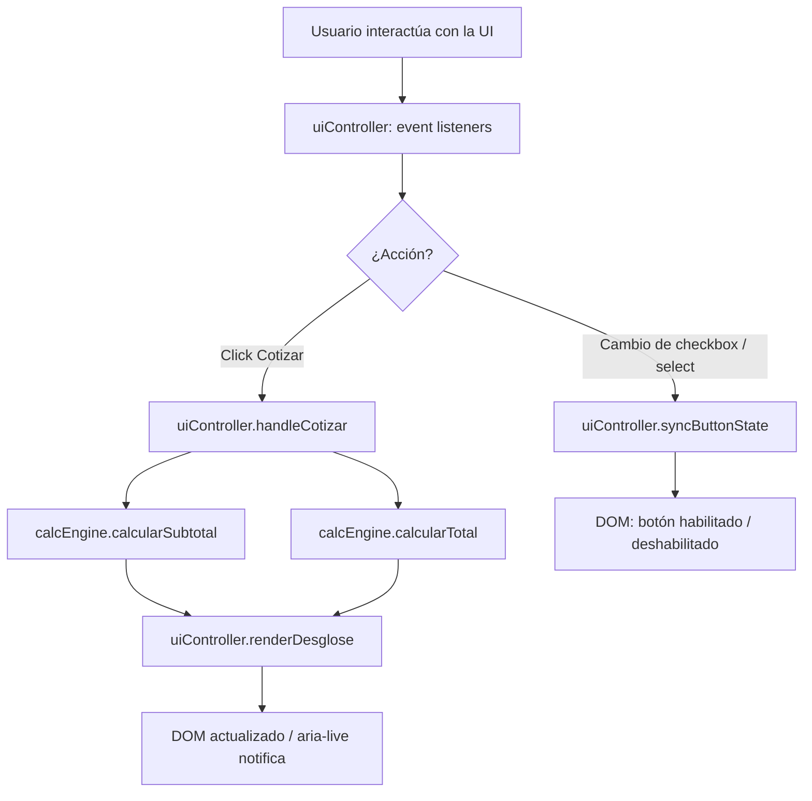

# Design Document — Cotizador UI

## Overview

El **Cotizador de Calzado** es una aplicación web de página única (`index.html`) que permite obtener cotizaciones instantáneas para reparación de calzado. Toda la lógica, los estilos y el marcado residen en un único archivo sin dependencia de servidor; el usuario puede abrirlo directamente desde el sistema de archivos con el protocolo `file://`.

### Objetivos de diseño

- **Autocontenido**: un solo archivo `index.html` sin peticiones de red en tiempo de ejecución.
- **Sin framework**: HTML5 semántico + CSS3 + JavaScript (ES6+) vanilla para maximizar la compatibilidad y eliminar dependencias de empaquetado.
- **Corrección aritmética**: la lógica de cálculo de precios es pura (sin efectos secundarios) para facilitar pruebas unitarias y de propiedades.
- **Accesibilidad básica**: WCAG 2.1 nivel AA de forma razonable para una UI de formulario.

---

## Architecture

La aplicación sigue el patrón **MVC ligero dentro del mismo archivo**, separado en tres capas lógicas aunque físicamente en un único HTML:

```
index.html
├── <style>          → Capa de Vista (CSS)
├── <body>           → Capa de Vista (HTML semántico)
└── <script>
    ├── CONFIG       → Datos / Modelo (catálogo y configuración)
    ├── calcEngine   → Lógica de dominio pura (sin DOM)
    └── uiController → Controlador (manejo de eventos y actualización del DOM)
```



### Decisiones de diseño

| Decisión | Alternativa descartada | Razón |
|---|---|---|
| JS vanilla | React / Vue | Sin build tools; apertura directa por `file://` |
| Lógica pura separada del DOM | Todo en event handlers | Permite pruebas unitarias sin JSDOM |
| Catálogo declarado en `CONFIG` | Hardcoded en HTML | Facilita mantenimiento y cambio de precios |
| `aria-live="polite"` en el wrapper del desglose | Leer atributo dinámicamente | El elemento debe existir en el DOM antes de la primera actualización |

---

## Components and Interfaces

### 1. Módulo `CONFIG` (objeto literal)

Contiene todos los valores configurables de la aplicación. Es la única fuente de verdad para datos y constantes.

```js
const CONFIG = {
  // Porcentaje de recargo por urgencia (entero 1–100)
  recargo_urgencia: 20,

  // Catálogo de tipos de calzado
  tipos_calzado: [
    { id: 'zapato',   label: 'Zapato' },
    { id: 'bota',     label: 'Bota'   },
    { id: 'sandalia', label: 'Sandalia' },
    { id: 'tenis',    label: 'Tenis'  },
    // Se pueden agregar más sin límite
  ],

  // Catálogo de reparaciones (5–20 elementos)
  reparaciones: [
    { id: 'suela',    label: 'Cambio de suela',  precio: 250.00 },
    { id: 'costura',  label: 'Costura',           precio: 120.00 },
    { id: 'lustrado', label: 'Lustrado',          precio:  80.00 },
    { id: 'pegado',   label: 'Pegado',            precio:  90.00 },
    { id: 'tacon',    label: 'Cambio de tacón',   precio: 180.00 },
  ],
};
```

### 2. Módulo `calcEngine` (funciones puras)

Toda la aritmética de cotización reside aquí. **No accede al DOM**; recibe datos y devuelve valores.

```js
const calcEngine = {
  /**
   * Suma los precios base de las reparaciones seleccionadas.
   * @param {Reparacion[]} reparaciones - Todas las reparaciones del catálogo.
   * @param {Set<string>}  seleccionados - IDs de reparaciones activas.
   * @returns {number} Subtotal (≥ 0).
   */
  calcularSubtotal(reparaciones, seleccionados) { ... },

  /**
   * Calcula el total aplicando o no el recargo de urgencia.
   * @param {number}  subtotal
   * @param {boolean} urgente
   * @param {number}  recargoPorc - Entero 1–100.
   * @returns {number} Total.
   */
  calcularTotal(subtotal, urgente, recargoPorc) { ... },

  /**
   * Formatea un número como string con exactamente 2 decimales.
   * @param {number} valor
   * @returns {string} p. ej. "250.00"
   */
  formatearMoneda(valor) { ... },
};
```

### 3. Módulo `uiController` (gestión de DOM y eventos)

Coordina la UI: lee el estado del DOM, delega los cálculos a `calcEngine` y escribe los resultados de vuelta al DOM.

```js
const uiController = {
  /** Referencia a elementos del DOM (cacheados al cargar). */
  elements: {
    selectCalzado,    // <select id="sel-calzado">
    checkboxesRep,    // NodeList de <input type="checkbox" class="rep-check">
    checkboxUrgencia, // <input type="checkbox" id="chk-urgencia">
    btnCotizar,       // <button id="btn-cotizar">
    seccionDesglose,  // <section id="desglose">
    listaDesglose,    // <ul id="desglose-lista">
    spanSubtotal,     // <span id="desglose-subtotal">
    spanRecargo,      // <span id="desglose-recargo">
    spanTotal,        // <span id="desglose-total">
    mensajeError,     // <div id="mensaje-error" role="alert">
    indicadorStale,   // <div id="indicador-stale"> (marca desglose desactualizado)
  },

  /** Inicializa los listeners y el estado inicial al cargar la página. */
  init() { ... },

  /**
   * Lee los checkboxes activos y habilita/deshabilita el Boton_Cotizar.
   * Se llama en cada cambio de checkbox.
   */
  syncButtonState() { ... },

  /**
   * Maneja el click en Boton_Cotizar:
   *   1. Valida que haya selección y tipo de calzado.
   *   2. Llama a calcEngine.
   *   3. Llama a renderDesglose.
   */
  handleCotizar() { ... },

  /**
   * Escribe el resultado en el DOM y revela la sección de desglose.
   * @param {DesgloseCotizacion} desglose
   */
  renderDesglose(desglose) { ... },

  /**
   * Marca el desglose existente como desactualizado.
   * Se llama cuando cambia cualquier input DESPUÉS de haber cotizado.
   */
  markDesglosStale() { ... },

  /** Muestra un mensaje de error en la región de alertas. */
  showError(msg) { ... },

  /** Limpia el mensaje de error visible. */
  clearError() { ... },
};
```

### 4. Estructura HTML (esqueleto semántico)

```html
<form id="cotizador-form" novalidate>
  <!-- Sección 1: Tipo de calzado -->
  <fieldset id="fs-calzado">
    <legend>Tipo de calzado</legend>
    <label for="sel-calzado">Tipo de calzado <span aria-hidden="true">*</span></label>
    <select id="sel-calzado" required>
      <option value="" disabled selected>Selecciona un tipo</option>
      <!-- Opciones generadas desde CONFIG.tipos_calzado -->
    </select>
  </fieldset>

  <!-- Sección 2: Reparaciones -->
  <fieldset id="fs-reparaciones">
    <legend>Tipos de reparación</legend>
    <!-- Checkboxes generados desde CONFIG.reparaciones -->
    <!-- <label for="chk-{id}">{label} — ${precio}</label> -->
  </fieldset>

  <!-- Sección 3: Urgencia -->
  <fieldset id="fs-urgencia">
    <legend>Urgencia</legend>
    <label for="chk-urgencia">
      <input type="checkbox" id="chk-urgencia">
      Urgente (+20%)   <!-- valor N interpolado desde CONFIG -->
    </label>
  </fieldset>

  <!-- Botón -->
  <button type="button" id="btn-cotizar" disabled>Cotizar</button>

  <!-- Región de errores (aria-live inmediato) -->
  <div id="mensaje-error" role="alert" aria-live="assertive" hidden></div>
</form>

<!-- Sección de desglose (aria-live polite, presente desde carga) -->
<section id="desglose" aria-live="polite" hidden>
  <div id="indicador-stale" hidden>⚠ Resultado desactualizado — vuelve a cotizar</div>
  <h2>Desglose de cotización</h2>
  <ul id="desglose-lista"></ul>
  <p>Subtotal: $<span id="desglose-subtotal"></span></p>
  <p>Recargo urgencia: $<span id="desglose-recargo"></span></p>
  <p><strong>Total: $<span id="desglose-total"></span></strong></p>
</section>
```

---

## Data Models

### `Reparacion`

```ts
interface Reparacion {
  id:     string;   // Identificador único (slug, p. ej. "suela")
  label:  string;   // Etiqueta descriptiva, ≤ 80 caracteres
  precio: number;   // Precio base en MXN, positivo con 2 decimales
}
```

### `TipoCalzado`

```ts
interface TipoCalzado {
  id:    string;  // Identificador único (slug)
  label: string;  // Nombre visible para el usuario
}
```

### `DesgloseCotizacion`

Objeto de resultado que `calcEngine` produce y `uiController` renderiza. **Nunca se persiste ni serializa**.

```ts
interface DesgloseCotizacion {
  items:     { reparacion: Reparacion; precioFormateado: string }[];
  subtotal:  number;   // Suma de precios base
  recargo:   number;   // Monto monetario del recargo (0 si no urgente)
  total:     number;   // subtotal + recargo
  urgente:   boolean;
  // Strings formateados para el DOM
  subtotalStr: string; // "250.00"
  recargoStr:  string; // "50.00" o "0.00"
  totalStr:    string; // "300.00"
}
```

### Estado de la aplicación (en memoria, no serializable)

```ts
interface AppState {
  desgloseMostrado: boolean;   // true tras el primer cotizar exitoso
  desglosStale:     boolean;   // true cuando hay cambios sin recotizar
}
```

La aplicación **no utiliza `localStorage` ni cookies**; el estado se pierde al recargar, cumpliendo el requisito 9 de inicio limpio.

---

## Correctness Properties

*Una propiedad es una característica o comportamiento que debe mantenerse en todas las ejecuciones válidas del sistema — esencialmente, una afirmación formal sobre lo que el sistema debe hacer. Las propiedades sirven como puente entre las especificaciones legibles por humanos y las garantías de corrección verificables por máquina.*

### Property 1: Subtotal es la suma exacta de los precios seleccionados

*Para cualquier* subconjunto no vacío de reparaciones del catálogo, el `Subtotal` calculado por `calcEngine.calcularSubtotal` debe ser numéricamente igual a la suma de los `precio` de cada reparación en ese subconjunto.

**Validates: Requirements 2.2, 2.3, 2.4, 5.1**

---

### Property 2: Total con urgencia aplica el factor correctamente

*Para cualquier* subconjunto no vacío de reparaciones y cualquier valor válido de `recargo_urgencia` (entero en [1, 100]), cuando la urgencia está activa, el `Total` calculado por `calcEngine.calcularTotal` debe ser numéricamente igual a `Subtotal × (1 + recargo_urgencia / 100)`.

**Validates: Requirements 3.2, 5.2**

---

### Property 3: Total sin urgencia es igual al Subtotal

*Para cualquier* subconjunto no vacío de reparaciones, cuando la urgencia está inactiva, el `Total` calculado por `calcEngine.calcularTotal` debe ser numéricamente igual al `Subtotal`, sin recargo adicional.

**Validates: Requirements 3.3, 5.3**

---

### Property 4: El botón Cotizar está habilitado si y sólo si hay al menos una reparación seleccionada

*Para cualquier* estado del formulario, `btnCotizar.disabled` debe ser `true` cuando el conjunto de checkboxes activos es vacío, y `false` cuando hay al menos un checkbox activo. Esta propiedad incluye el caso de round-trip: habilitar y luego deseleccionar todo debe devolver el botón a `disabled`.

**Validates: Requirements 4.1, 4.2, 4.3**

---

### Property 5: El desglose renderizado contiene todos los campos con formato correcto

*Para cualquier* selección de reparaciones y estado de urgencia, cuando se activa el Boton_Cotizar, el HTML del desglose debe contener: el nombre de cada reparación seleccionada, su precio con exactamente 2 decimales, el subtotal con 2 decimales, el recargo con 2 decimales (incluyendo "0.00" si no aplica) y el total con 2 decimales.

**Validates: Requirements 5.4**

---

### Property 6: El desglose refleja únicamente la selección más reciente

*Para cualquier* secuencia de selecciones seguida de múltiples activaciones del Boton_Cotizar, el desglose mostrado después del último cotizar debe reflejar exclusivamente la selección presente en ese momento, sin valores residuales de cotizaciones anteriores.

**Validates: Requirements 5.7, 6.2**

---

### Property 7: Cualquier cambio tras cotizar activa el indicador de desactualizado

*Para cualquier* modificación del estado del formulario (cambio de checkbox de reparación o cambio de estado de urgencia) realizada después de haber generado un desglose visible, el indicador visual de "desactualizado" debe aparecer inmediatamente. Tras volver a cotizar, el indicador debe desaparecer.

**Validates: Requirements 6.1, 6.2**

---

### Property 8: Cotizar sin tipo de calzado seleccionado siempre produce error

*Para cualquier* combinación de reparaciones seleccionadas (incluso combinaciones válidas), si el selector de tipo de calzado tiene el valor vacío (marcador de posición), activar el Boton_Cotizar debe resultar en un mensaje de error visible y el desglose no debe mostrarse ni actualizarse.

**Validates: Requirements 1.4**

---

## Error Handling

### Errores de validación de usuario

| Condición | Comportamiento |
|---|---|
| Cotizar sin Tipo_de_Calzado seleccionado | Mostrar mensaje en `#mensaje-error` (aria-live assertive); no calcular ni mostrar desglose |
| Cotizar sin ninguna reparación seleccionada | El botón está disabled; si se dispara por script, mostrar error en `#mensaje-error`; no calcular |
| Recargo_Urgencia ausente o fuera de rango [1,100] | Deshabilitar `#chk-urgencia`; mostrar mensaje informativo inline junto al checkbox |

### Errores de configuración

| Condición | Comportamiento |
|---|---|
| `CONFIG.reparaciones` con menos de 5 o más de 20 items | Mostrar advertencia en consola; renderizar lo que haya y continuar |
| Etiqueta de reparación > 80 caracteres | Truncar en el DOM con ellipsis; log en consola |
| `precio` de reparación no numérico o negativo | Omitir esa reparación del catálogo y registrar advertencia en consola |

### Errores de cálculo (req 6.3)

Si `calcEngine` lanza una excepción durante el recálculo (p. ej. desbordamiento numérico en navegadores muy antiguos):
- El desglose anterior permanece visible y marcado como desactualizado.
- Se muestra un mensaje de error en `#mensaje-error` indicando que no fue posible actualizar el resultado.
- El error se registra en `console.error`.

### Compatibilidad de navegador (req 7.5)

Al inicio, se verifica la presencia de las APIs mínimas requeridas:

```js
if (!document.querySelector || !document.addEventListener || !Array.from) {
  // Mostrar banner de incompatibilidad y detener la inicialización
}
```

---

## Testing Strategy

### Herramienta recomendada

La lógica de dominio pura (`calcEngine`) es ideal para pruebas de propiedades. Se recomienda:

- **[fast-check](https://github.com/dubzzz/fast-check)** (JavaScript) para pruebas basadas en propiedades.
- **[Vitest](https://vitest.dev/)** como runner de pruebas (compatible con archivos `.js` sin build step).
- Para pruebas de DOM se usará **[JSDOM](https://github.com/jsdom/jsdom)** vía Vitest.

> Nota: dado que `index.html` es el artefacto final, las pruebas extraen `calcEngine` a un módulo ES separado durante el desarrollo y lo incrustan al generar el HTML de producción, o bien se prueba directamente el script embebido a través de JSDOM.

---

### Pruebas unitarias (ejemplo-based)

| ID | Qué verifica | Criterio |
|---|---|---|
| U-01 | DOM inicial: select con ≥4 opciones y placeholder disabled | Req 1.1, 1.2 |
| U-02 | DOM inicial: todos los checkboxes desmarcados, botón disabled, desglose oculto | Req 9.1–9.4 |
| U-03 | Etiqueta urgencia muestra el porcentaje del CONFIG | Req 3.1 |
| U-04 | CONFIG.recargo_urgencia inválido → checkbox urgencia disabled + mensaje | Req 3.5 |
| U-05 | Estilos del botón disabled: opacity ≤ 0.4, cursor not-allowed | Req 4.4 |
| U-06 | Click en botón disabled no produce cambios en el DOM | Req 4.5 |
| U-07 | Cotizar sin Tipo_de_Calzado → error visible, sin desglose | Req 1.4 |
| U-08 | Cotizar con selección válida → sección desglose visible | Req 5.6, 5.7 |
| U-09 | Etiquetas de controles asociadas con `for`/`id` correctos | Req 8.1 |
| U-10 | Boton_Cotizar tiene atributo `disabled` en el elemento HTML | Req 8.3 |
| U-11 | Elemento con `aria-live="polite"` existe en DOM desde carga | Req 8.4 |
| U-12 | Error de recálculo → desglose previo persiste con indicador stale | Req 6.3 |

---

### Pruebas de propiedades (property-based)

Cada prueba se etiqueta en el código con:
`// Feature: cotizador-ui, Property {N}: {texto de la propiedad}`

Se ejecutan mínimo **100 iteraciones** por propiedad.

#### PBT-01 — Subtotal es la suma exacta

```
// Feature: cotizador-ui, Property 1: Subtotal es la suma exacta de los precios seleccionados
Generadores:
  - subconjunto no vacío de CONFIG.reparaciones (fast-check: fc.subarray con minLength=1)
Invariante:
  calcEngine.calcularSubtotal(reparaciones, new Set(seleccionados.map(r => r.id)))
    === seleccionados.reduce((acc, r) => acc + r.precio, 0)
```

#### PBT-02 — Total con urgencia

```
// Feature: cotizador-ui, Property 2: Total con urgencia aplica el factor correctamente
Generadores:
  - subconjunto no vacío de reparaciones
  - recargo: fc.integer({ min: 1, max: 100 })
Invariante:
  calcEngine.calcularTotal(subtotal, true, recargo)
    ≈ subtotal * (1 + recargo / 100)   [tolerancia: ±0.001 por redondeo de punto flotante]
```

#### PBT-03 — Total sin urgencia

```
// Feature: cotizador-ui, Property 3: Total sin urgencia es igual al Subtotal
Generadores:
  - subconjunto no vacío de reparaciones
  - recargo: fc.integer({ min: 1, max: 100 })
Invariante:
  calcEngine.calcularTotal(subtotal, false, recargo) === subtotal
```

#### PBT-04 — Estado del botón Cotizar

```
// Feature: cotizador-ui, Property 4: botón habilitado ↔ hay al menos una reparación seleccionada
Generadores:
  - subconjunto aleatorio de reparaciones (puede ser vacío: fc.subarray con minLength=0)
Invariante:
  btnCotizar.disabled === (seleccionados.length === 0)
```

#### PBT-05 — Formato del desglose

```
// Feature: cotizador-ui, Property 5: desglose renderizado contiene todos los campos con formato correcto
Generadores:
  - subconjunto no vacío de reparaciones
  - urgente: fc.boolean()
Invariante (sobre el string HTML renderizado):
  - Cada reparación seleccionada aparece en el desglose
  - Todos los valores monetarios coinciden con el regex /\d+\.\d{2}/
  - El total corresponde al calculado por calcEngine
```

#### PBT-06 — Desglose refleja selección más reciente

```
// Feature: cotizador-ui, Property 6: desglose refleja únicamente la selección más reciente
Generadores:
  - dos subconjuntos distintos no vacíos de reparaciones: seleccion1, seleccion2
Secuencia:
  1. Activar seleccion1 → cotizar → verificar desglose muestra seleccion1
  2. Cambiar a seleccion2 → cotizar → verificar desglose muestra seleccion2 (no seleccion1)
```

#### PBT-07 — Indicador de desactualizado

```
// Feature: cotizador-ui, Property 7: cambio tras cotizar activa indicador de desactualizado
Generadores:
  - subconjunto no vacío inicial
  - al menos un cambio (toggle de checkbox o urgencia)
Invariante:
  Tras el cambio: indicadorStale.hidden === false
  Tras volver a cotizar: indicadorStale.hidden === true
```

#### PBT-08 — Cotizar sin tipo de calzado siempre falla

```
// Feature: cotizador-ui, Property 8: cotizar sin tipo calzado produce error para cualquier selección
Generadores:
  - subconjunto no vacío de reparaciones (asegura que el botón esté habilitado)
  - selectCalzado.value = "" (forzado)
Invariante:
  Tras disparar handleCotizar():
  - mensajeError.hidden === false
  - seccionDesglose.hidden === true (o igual que antes si ya había desglose)
```

---

### Pruebas de humo (smoke tests)

| ID | Qué verifica |
|---|---|
| S-01 | `index.html` se abre en navegador sin errores de consola |
| S-02 | `CONFIG.recargo_urgencia` está en rango [1, 100] con valor default 20 |
| S-03 | La sección desglose está oculta al cargar |
| S-04 | El archivo no realiza peticiones de red (comprobado con DevTools offline) |
